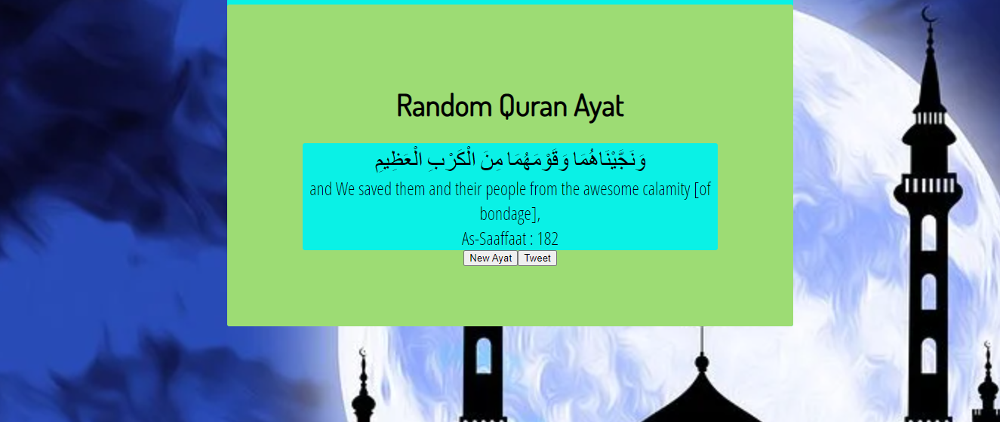

# Random Quran Ayat

The Quran, also romanized Qur'an or Koran, is the central religious text of Islam, believed by Muslims to be a revelation from Allah. It is widely regarded as the finest work in classical Arabic literature. It is organized in 114 chapters, which consist of verses

This Website will Generat Random Quran Ayat With Arabic and Ebglish Meaning. You can also share it on twetter or facebook.

## Demo




## API Reference

#### Get ayah

```js
  function getQuote() {
  var ayah = Math.floor(Math.random() * 6236) + 1 
  var url = "https://api.alquran.cloud/ayah/"+ayah+"/en.asad";
  var urlArabic = "https://api.alquran.cloud/ayah/"+ayah;
  arText;
  enText;
  surah;
  ayahNumber;
  surahAndAyah;
  
  $.getJSON( urlArabic, function(data) {
    arText = data.data.text;
    document.getElementById("arabicVerseText").innerHTML = arText;
    console.log(arText);
  });
```


## 🚀 Special Thank You 
[SAS]()


## License

[MIT](https://choosealicense.com/licenses/mit/)

